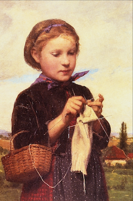

## What is reproducible research?

```{r, include = FALSE}
library("ggplot2")
options(digits = 2)
library("ggvis")
```

```{r, echo=FALSE}
library("knitr")
```
 
"The final product of research is not only the paper itself, but also the full __computation environment__ used to produce the results in the paper such as the __code__ and __data__ necessary for reproduction of the results and building upon the research." (Xie, 2014).

Articles submitted for journals should include:

- Manuscript
- Code 
- Data

Obviously, this is not always possible!

## Tools for reproducibilty

- [R](http://r-project.org)
- [knitr](http://yihui.name/knitr/)
- [Markdown](http://daringfireball.net/projects/markdown/) or [LaTeX](http://www.latex-project.org/) (_others exist (e.g. HTML) and you can create your own too_ )

Which one should you use, see [Yihue Xie's post](http://yihui.name/en/2013/10/markdown-or-latex/). 

- [Rstudio](http://www.rstudio.com) (_recommended_, if you're not wedded to an IDE)

The developers of Rstudio are often the first to integrate the latest and greatest from `R`. Else, [ESS](http://ess.r-project.org/) and [LyX](http://www.lyx.org/) are fully integrated with `knitr` or add a custom command to your favorite editor. 

## Knitting {.flexbox .vcenter}


## Why `knitr`?

```{r, eval=FALSE}
install.packages("knitr", dependencies = TRUE)
```

How can `knitr` help us achieve reproducibility?

1. We __never__ need to copy and paste results into reports.
2. If the data changes, our models, figures, and tables are __automatically updated__*.
3. From a `knitr` document, automatically generate a report using `knit()` or extract the `R` code using `purl()`.
5. Generate a LaTeX or Markdown report from an `R` script with `stitch()` and add text with `spin()`
4. It is much more feature rich than Sweave.

## `knitr` basics

```{r, echo = FALSE, comment = NA}
cat("Generates PDF\nknit('knit_toy/knit_toy.Rnw')\n\nGenerates R script\npurl('purl_toy/purl_toy.Rnw')\n\nGenerates PDF\nstitch('stitch_toy/stitch_toy.R')\n\nGenerates Markdown\nspin('spin_toy/spin_toy.R')")
```

## Markdown and Shiny demonstration

```{r, eval = FALSE}
if(!require("shiny"))
  install.packages("shiny")
demo("notebook", package = "knitr")
```

## Chunks

Input is evaluated in chunks. Either __code chunks__

For `knitr`, chunks are what we write `R` code in. 

    ```{r}`r ''`
    <insert R code for Markdown>
    ```

    <<>>=`r ''`
    <insert R code for LaTeX>
    @

Throughout I use __Markdown__ syntax as I've created an [ioslide](https://code.google.com/p/io-2012-slides/) presentation using [RMarkdown](http://rmarkdown.rstudio.com/ioslides_presentation_format.html). However, the `chunk.begin` and `chunk.end` syntax can __always__ be interchanged. (In fact, you can roll your own syntax for these if you hate the above!)


## More on chunks

* Chunks have a plethora of options available by default 
* You can also 'roll your own' chunk options provided they are valid `R` code.

```{r}
length(opts_chunk$get())
opts_chunk$get("engine")
```

* `knitr` works with other languagues too (python, ruby, etc) 

## `knitr` output  
* `knitr` output may be __inline__
```{r, comment = NA, echo = FALSE}
cat("\`r <insert R code for Markdown>`\n\n\\Sexpr{<insert R code for LaTeX>}")
```

* A realization of a $\chi_2^2$ is `r rchisq(1, df = 2)`.
```{r, comment = NA, echo = FALSE}
cat("A realization of a $\\chi_2^2$ is `r rchisq(1, df = 2)`.")
```

* Chunk option can for __text__, __tabular__, or __graphical__ output.

## Chunk output
* What will this generate?
    
    ```{r, cool_chunk, eval = -1, echo = c(1, 3), warning = FALSE, message = FALSE, fig.align ='center'}`r ''`
    
    coef(lm(dist ~ speed, data = cars))[1]
    
    ggplot(aes(x=speed, y = dist), data = cars) + geom_point(col = "#56B4E9") + geom_smooth(col = "999999") + theme_bw() + ylab("Driving Speed") + xlab("Distance to Stop")
    
    rnorm(0, sd = -1)

``````

## Answer
```{r, cool_chunk, eval = -1, echo = c(1, 3), warning = FALSE, message = FALSE, fig.align ='center'}
coef(lm(dist ~ speed, data = cars))[1]
ggplot(aes(x=speed, y = dist), data = cars) + geom_point(col = "#56B4E9") + geom_smooth(col = "999999") + theme_bw() + ylab("Driving Speed") + xlab("Distance to Stop")
rnorm(0, sd = -1)
```


## Helpful chunk output options
* `eval = TRUE` : Evaluate all or part of the current chunk
* `echo = TRUE` : Show all or part of the source code
* `results = 'asis'` : Writes raw output from R to the output document without markup. Helpful for creating tables with `xtable`. `markup` is the default.
* `include = TRUE` : Code chunk will be included in output. If you don't want a chunk in the output but _still_ evaluated set this to `FALSE`

## Perhaps helpful?
```{r}
foo <- 2
bar <- foo
```

```{r eval = foo < bar, echo = FALSE}
cat("foo is greater than bar")
```

```{r eval = foo == bar, echo = FALSE}
cat("they are the same")
```

## The code 
```{r, comment=NA, echo = FALSE}
cat("```{r}\nfoo <- 2\nbar <- foo\n```\n```{r eval = foo < bar, echo = FALSE}\ncat(\"foo is greater than bar\")\n```\n```{r eval = foo == bar, echo = FALSE}\ncat(\"they are the same\")\n```")
```


## Local vs. global settings
* Often we want to set options for our entire document rather than for every chunk
* Set figure width equal to 6 with a center alignment and hide all `R` code

__Local__ (_tedious_) 
```{r, comment=NA, echo = FALSE}
cat("```{r fig.width = 6, fig.align = 'center', echo = FALSE}\nplot(rnorm(10))\n```")
```
__Global__ (_smart_)
```{r, comment=NA, echo = FALSE}
cat("```{r}\nopts_chunk$set(fig.width=6, fig.align = 'center', echo = FALSE))\n```")
```

## Tables
Tables are easily handled with `xtable`. Make sure to specify `results = "asis"` to render the table. 
```{r, results = "asis",echo=FALSE}
library(xtable)
mod1 <- lm(dist ~ speed, data = cars)
coef_tab <- summary(mod1)$coef
print(xtable(mod1), type = "html")
```
<p>
</p>
Finer control of tables with LaTeX. Finally, we can insert our fitted model using inline code:

$\hat{dist}_i = `r coef_tab[1,1]` + `r coef_tab[2,1] ` speed_i$

## Code used
    ```{r, results = "asis", echo=FALSE}`r ''`
    library(xtable)
    mod1 <- lm(dist ~ speed, data = cars)
    coef_tab <- summary(mod1)$coef
    print(xtable(mod1), type = "html")
    ```
    
For the inline code:
```{r,comment = NA, echo = FALSE}
cat("$\\hat{dist_i} = `r coef_tab[1,1]` + `r coef_tab[2,1] ` speed_i$")
```

## Using an ioslides table

-------------------------------------------------------------
Coefficients     Estimate     Standard    t-value     Pr(>|t|)
                              Error   
-------------- ------------ ----------- ----------- ------------
`r rownames(coef_tab)[1] `    `r coef_tab[1,1]`        `r coef_tab[1,2]`        `r coef_tab[1,3]`       `r coef_tab[1,4]`  

`r rownames(coef_tab)[2] `              `r coef_tab[2,1]`      `r coef_tab[2,2]`         `r coef_tab[2,3]`       `r coef_tab[2,4]`  
-------------------------------------------------------------

## Interactive figures (`ggvis`) {.flexbox .vcenter}
```{r fig.height=3, fig.width=3, fig.align='center', echo = FALSE}
mtcars %>% ggvis(~wt, ~mpg, size := 300, opacity := 0.4) %>% layer_points()
```

## Figures options
* `dev = 'png'` : Sets the default graphical device. `tikz` has nicer font rendering for LaTeX. Can interact with `ggobi`, `graphviz`, `rgl`, etc. 
* `fig.width` and `fig.height` : Sets width and height of the device.
* `fig.cap` and `fig.align` : Set a caption and alignment
* Able to set encoding (for Icelandic characters) and dingbat font (reduces the size of pdfs).
* Can send additional graphic device specific arguments via `dev.args = list(option1 = "foo", option2 = "bar")`

## `cache = TRUE`
* Caching is  helpful if you have a large document or `R` takes a long time to evaluate certain chunks.
* Caching compares the MD5 hash of a cached chunk with the MD5 hash of the same cache when `knit()` is re-run
* Manually set cache dependencies (i.e Chunk B depends on A) or do this automatically (`autodep = TRUE`)
* Adding _new data won't update a cache_. One way to enable this is `file.info()` function in the chunk. For example,
```{r,comment = NA, echo = FALSE}
cat("```{r, foo_time = file.info('foo.csv')$mtime}\nfoo <- read.csv(\"foo\")\n...")

```

## Embed code chunks
```{r,comment = NA, echo = FALSE}
cat("```{r, A}\ny <- rcauchy(1)\n```\n```{r, B}\ny\n<<A>>\ny\n```")
```
* Chunks can be nest recursively with each other as long as the recursion is finite. 


## The answer
```{r A}
y <- rcauchy(1)
```
```{r B}
y
<<A>>
y
```

## Reusing whole chunks
```{r,comment = NA, echo = FALSE}
cat("```{r, cau, include = FALSE, eval = FALSE}\ny <- rcauchy(1)\n```\n```{r, norm, include = FALSE, eval = FALSE}\ny\nx <- y + rnorm(1)\nx\n```\n```{r, C, ref.label = c('cau','norm')\n```")
```

## And the output
```{r, cau, include = FALSE, eval = FALSE}
y <- rcauchy(1)
```
```{r, norm, include = FALSE, eval = FALSE}
y
x <- y + rnorm(1)
x
```
```{r, C, ref.label = c('cau','norm')}
```

## External code
* External chunk code can be kept in `R` scripts and can be referenced by chunk label or the line number.

```{r,comment = NA, echo = FALSE}
cat("## @knitr nitrogen_conversion\ntons_mgN <- function(tons, unit){\nmgN <- (tons * 1e9) / 20 / 5.7 / unit\nreturn(mgN)\n}\n")
```

```{r,comment = NA, echo = FALSE}
cat("read_chunk(\"nitrogen_conversions.R\")")
```

```{r,comment = NA, echo = FALSE}
cat("```{r, nitrogen_conversion}\n```")
```
* specify `from` and `to` arguments to use lines numbers in `read_chunk()`.

## Child documents
* Just like LaTeX, child documents (`\include{foo.tex}`) consisting of smaller parts can be used with `knitr`.
* Consist of plain chunks
* To use this just specify the `child ='foo.Rnw'` or `'foo.Rmd'` if using `Rmarkdown`.
* These could be called _conditionally_. For example, if you were doing a report and only ran an additional set of analyses conditional on some output.
* `child = if(bar > foo) 'foo.Rnw'`


## Hooks
* Hooks allow you to expand the capability of `knitr`. 
* Chunk hooks can be called before (say want to crop the margins of a graph via `par()` or after the chunk (if you want to insert commands into output like LaTeX or Markdown commands).
* See [Yihui's hooks page](http://yihui.name/knitr/hooks) for more details. 

## Packrat
* [Packrat](http://cran.r-project.org/web/packages/packrat/) is an R package that helps you manage your project’s R package dependencies in an isolated, reproducible and portable way.
* `init()`, initialize a new packrat project.
* `snapshot()`, take a snapshot of the installed packages.
* `bundle()`, bundles (tarball) a packrat project for sharing.
* `unbundle()`, unbundles a packrat project.
* This will modify `.Rprofile`! 


## Reproducing research
* Reproducing research should be easier.
* `knitr` makes creating dynamic reports very simple.
* You should be able to share data and an `Rmd` or an `Rnw` file with a friend, colleague, or reviewer and they __should__ be able to replicate your findings.

## Learning more
* `knitr` has an excellent [website](http://yihui.name/knitr)
* Purchase Yihui's book from [Amazon](http://www.amazon.com/dp/1482203537/ref=cm_sw_su_dp) (_recommended_)
* Visit StackOverflow and search on the tag `knitr`
* [Rstudio blog](http://blog.rstudio.org/). Lots of interesting things happen here. 


##{.flexbox .vcenter}


<p>
</p>

<div, font-size = 20pt, class="blue2">
Thanks for coming
<div>

<p>
</p>
<p>
</p>

[https://lundinn.github.io/](https://lundinn.github.io/)


