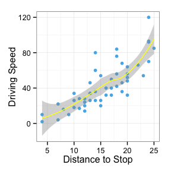

# Creating reproducible research with `knitr`
Christopher David Desjardins  
26 September 2014 @ R-Ísland UG  

## What is reproducible research?


 
"The final product of research is not only the paper itself, but also the full __computation environment__ used to produce the results in the paper such as the __code__ and __data__ necessary for reproduction of the results and building upon the research." (Xie, 2014).

Articles submitted for journals should include:

- Manuscript
- Code 
- Data

Obviously, this is not always possible!

## Tools for reproducibilty

- [R](http://r-project.org)
- [knitr](http://yihui.name/knitr/)
- [Markdown](http://daringfireball.net/projects/markdown/) or [LaTeX](http://www.latex-project.org/) (_others exist (e.g. HTML) and you can create your own too_ )

Which one should you use, see [Yihue Xie's post](http://yihui.name/en/2013/10/markdown-or-latex/). 

- [Rstudio](http://www.rstudio.com) (_recommended_, if you're not wedded to an IDE)

The developers of Rstudio are often the first to integrate the latest and greatest from `R`. Else, [ESS](http://ess.r-project.org/) and [LyX](http://www.lyx.org/) are fully integrated with `knitr` or add a custom command to your favorite editor. 

## Knitting {.flexbox .vcenter}


## Why `knitr`?


```r
install.packages("knitr", dependencies = TRUE)
```

How can `knitr` help us achieve reproducibility?

1. We __never__ need to copy and paste results into reports.
2. If the data changes, our models, figures, and tables are __automatically updated__*.
3. From a `knitr` document, automatically generate a report using `knit()` or extract the `R` code using `purl()`.
5. Generate a LaTeX or Markdown report from an `R` script with `stitch()` and add text with `spin()`
4. It is much more feature rich than Sweave.

## `knitr` basics


```
Generates PDF
knit('knit_toy/knit_toy.Rnw')

Generates R script
purl('purl_toy/purl_toy.Rnw')

Generates PDF
stitch('stitch_toy/stitch_toy.R')

Generates Markdown
spin('spin_toy/spin_toy.R')
```

## Markdown and Shiny demonstration


```r
if(!require("shiny"))
  install.packages("shiny")
demo("notebook", package = "knitr")
```

## Chunks

Input is evaluated in chunks. Either __code chunks__

For `knitr`, chunks are what we write `R` code in. 

    ```{r}
    <insert R code for Markdown>
    ```

    <<>>=
    <insert R code for LaTeX>
    @

Throughout I use __Markdown__ syntax as I've created an [ioslide](https://code.google.com/p/io-2012-slides/) presentation using [RMarkdown](http://rmarkdown.rstudio.com/ioslides_presentation_format.html). However, the `chunk.begin` and `chunk.end` syntax can __always__ be interchanged. (In fact, you can roll your own syntax for these if you hate the above!)


## More on chunks

* Chunks have a plethora of options available by default 
* You can also 'roll your own' chunk options provided they are valid `R` code.


```r
length(opts_chunk$get())
```

```
## [1] 52
```

```r
opts_chunk$get("engine")
```

```
## [1] "R"
```

* `knitr` works with other languagues too (python, ruby, etc) 

## `knitr` output  
* `knitr` output may be __inline__

```
`r <insert R code for Markdown>`

\Sexpr{<insert R code for LaTeX>}
```

* A realization of a $\chi_2^2$ is 1.72.

```
A realization of a $\chi_2^2$ is `r rchisq(1, df = 2)`.
```

* Chunk option can for __text__, __tabular__, or __graphical__ output.

## Chunk output
* What will this generate?
    
    ```{r, cool_chunk, eval = -1, echo = c(1, 3), warning = FALSE, message = FALSE, fig.align ='center'}
    
    coef(lm(dist ~ speed, data = cars))[1]
    
    ggplot(aes(x=speed, y = dist), data = cars) + geom_point(col = "#56B4E9") + geom_smooth(col = "999999") + theme_bw() + ylab("Driving Speed") + xlab("Distance to Stop")
    
    rnorm(0, sd = -1)

``````

## Answer

```r
## coef(lm(dist ~ speed, data = cars))[1]
```



```r
rnorm(0, sd = -1)
```

```
## numeric(0)
```


## Helpful chunk output options
* `eval = TRUE` : Evaluate all or part of the current chunk
* `echo = TRUE` : Show all or part of the source code
* `results = 'asis'` : Writes raw output from R to the output document without markup. Helpful for creating tables with `xtable`. `markup` is the default.
* `include = TRUE` : Code chunk will be included in output. If you don't want a chunk in the output but _still_ evaluated set this to `FALSE`

## Perhaps helpful?

```r
foo <- 2
bar <- foo
```


```
## they are the same
```

## The code 

````
```{r}
foo <- 2
bar <- foo
```
```{r eval = foo < bar, echo = FALSE}
cat("foo is greater than bar")
```
```{r eval = foo == bar, echo = FALSE}
cat("they are the same")
```
````


## Local vs. global settings
* Often we want to set options for our entire document rather than for every chunk
* Set figure width equal to 6 with a center alignment and hide all `R` code

__Local__ (_tedious_) 

````
```{r fig.width = 6, fig.align = 'center', echo = FALSE}
plot(rnorm(10))
```
````
__Global__ (_smart_)

````
```{r}
opts_chunk$set(fig.width=6, fig.align = 'center', echo = FALSE))
```
````

## Tables
Tables are easily handled with `xtable`. Make sure to specify `results = "asis"` to render the table. 
<!-- html table generated in R 3.1.1 by xtable 1.7-3 package -->
<!-- Fri Sep 26 14:39:40 2014 -->
<TABLE border=1>
<TR> <TH>  </TH> <TH> Estimate </TH> <TH> Std. Error </TH> <TH> t value </TH> <TH> Pr(&gt;|t|) </TH>  </TR>
  <TR> <TD align="right"> (Intercept) </TD> <TD align="right"> -17.5791 </TD> <TD align="right"> 6.7584 </TD> <TD align="right"> -2.60 </TD> <TD align="right"> 0.0123 </TD> </TR>
  <TR> <TD align="right"> speed </TD> <TD align="right"> 3.9324 </TD> <TD align="right"> 0.4155 </TD> <TD align="right"> 9.46 </TD> <TD align="right"> 0.0000 </TD> </TR>
   </TABLE>
<p>
</p>
Finer control of tables with LaTeX. Finally, we can insert our fitted model using inline code:

$\hat{dist}_i = -17.58 + 3.93 speed_i$

## Code used
    ```{r, results = "asis", echo=FALSE}
    library(xtable)
    mod1 <- lm(dist ~ speed, data = cars)
    coef_tab <- summary(mod1)$coef
    print(xtable(mod1), type = "html")
    ```
    
For the inline code:

```
$\hat{dist_i} = `r coef_tab[1,1]` + `r coef_tab[2,1] ` speed_i$
```

## Using an ioslides table

-------------------------------------------------------------
Coefficients     Estimate     Standard    t-value     Pr(>|t|)
                              Error   
-------------- ------------ ----------- ----------- ------------
(Intercept)    -17.58        6.76        -2.6       0.01  

speed              3.93      0.42         9.46       1.49\times 10^{-12}  
-------------------------------------------------------------

## Interactive figures (`ggvis`) {.flexbox .vcenter}
<!--html_preserve--><div id="plot_id762484009-container" class="ggvis-output-container">
<div id="plot_id762484009" class="ggvis-output"></div>
<div class="plot-gear-icon">
<nav class="ggvis-control">
<a class="ggvis-dropdown-toggle" title="Controls" onclick="return false;"></a>
<ul class="ggvis-dropdown">
<li>
Renderer: 
<a id="plot_id762484009_renderer_svg" class="ggvis-renderer-button" onclick="return false;" data-plot-id="plot_id762484009" data-renderer="svg">SVG</a>
 | 
<a id="plot_id762484009_renderer_canvas" class="ggvis-renderer-button" onclick="return false;" data-plot-id="plot_id762484009" data-renderer="canvas">Canvas</a>
</li>
<li>
<a id="plot_id762484009_download" class="ggvis-download" data-plot-id="plot_id762484009">Download</a>
</li>
</ul>
</nav>
</div>
</div>
<script type="text/javascript">
var plot_id762484009_spec = {
	"data" : [
		{
			"name" : "mtcars0",
			"format" : {
				"type" : "csv",
				"parse" : {
					"wt" : "number",
					"mpg" : "number"
				}
			},
			"values" : "\"wt\",\"mpg\"\n2.62,21\n2.875,21\n2.32,22.8\n3.215,21.4\n3.44,18.7\n3.46,18.1\n3.57,14.3\n3.19,24.4\n3.15,22.8\n3.44,19.2\n3.44,17.8\n4.07,16.4\n3.73,17.3\n3.78,15.2\n5.25,10.4\n5.424,10.4\n5.345,14.7\n2.2,32.4\n1.615,30.4\n1.835,33.9\n2.465,21.5\n3.52,15.5\n3.435,15.2\n3.84,13.3\n3.845,19.2\n1.935,27.3\n2.14,26\n1.513,30.4\n3.17,15.8\n2.77,19.7\n3.57,15\n2.78,21.4"
		},
		{
			"name" : "scale/x",
			"format" : {
				"type" : "csv",
				"parse" : {
					"domain" : "number"
				}
			},
			"values" : "\"domain\"\n1.31745\n5.61955"
		},
		{
			"name" : "scale/y",
			"format" : {
				"type" : "csv",
				"parse" : {
					"domain" : "number"
				}
			},
			"values" : "\"domain\"\n9.225\n35.075"
		}
	],
	"scales" : [
		{
			"name" : "x",
			"domain" : {
				"data" : "scale/x",
				"field" : "data.domain"
			},
			"zero" : false,
			"nice" : false,
			"clamp" : false,
			"range" : "width"
		},
		{
			"name" : "y",
			"domain" : {
				"data" : "scale/y",
				"field" : "data.domain"
			},
			"zero" : false,
			"nice" : false,
			"clamp" : false,
			"range" : "height"
		}
	],
	"marks" : [
		{
			"type" : "symbol",
			"properties" : {
				"update" : {
					"fill" : {
						"value" : "#000000"
					},
					"size" : {
						"value" : 300
					},
					"opacity" : {
						"value" : 0.4
					},
					"x" : {
						"scale" : "x",
						"field" : "data.wt"
					},
					"y" : {
						"scale" : "y",
						"field" : "data.mpg"
					}
				},
				"ggvis" : {
					"data" : {
						"value" : "mtcars0"
					}
				}
			},
			"from" : {
				"data" : "mtcars0"
			}
		}
	],
	"width" : 288,
	"height" : 288,
	"legends" : [],
	"axes" : [
		{
			"type" : "x",
			"scale" : "x",
			"orient" : "bottom",
			"layer" : "back",
			"grid" : true,
			"title" : "wt"
		},
		{
			"type" : "y",
			"scale" : "y",
			"orient" : "left",
			"layer" : "back",
			"grid" : true,
			"title" : "mpg"
		}
	],
	"padding" : null,
	"ggvis_opts" : {
		"keep_aspect" : false,
		"resizable" : true,
		"padding" : {},
		"duration" : 250,
		"renderer" : "svg",
		"hover_duration" : 0,
		"width" : 288,
		"height" : 288
	},
	"handlers" : null
};
ggvis.getPlot("plot_id762484009").parseSpec(plot_id762484009_spec);
</script><!--/html_preserve-->

## Figures options
* `dev = 'png'` : Sets the default graphical device. `tikz` has nicer font rendering for LaTeX. Can interact with `ggobi`, `graphviz`, `rgl`, etc. 
* `fig.width` and `fig.height` : Sets width and height of the device.
* `fig.cap` and `fig.align` : Set a caption and alignment
* Able to set encoding (for Icelandic characters) and dingbat font (reduces the size of pdfs).
* Can send additional graphic device specific arguments via `dev.args = list(option1 = "foo", option2 = "bar")`

## `cache = TRUE`
* Caching is  helpful if you have a large document or `R` takes a long time to evaluate certain chunks.
* Caching compares the MD5 hash of a cached chunk with the MD5 hash of the same cache when `knit()` is re-run
* Manually set cache dependencies (i.e Chunk B depends on A) or do this automatically (`autodep = TRUE`)
* Adding _new data won't update a cache_. One way to enable this is `file.info()` function in the chunk. For example,

````
```{r, foo_time = file.info('foo.csv')$mtime}
foo <- read.csv("foo")
...
````

## Embed code chunks

````
```{r, A}
y <- rcauchy(1)
```
```{r, B}
y
<<A>>
y
```
````
* Chunks can be nest recursively with each other as long as the recursion is finite. 


## The answer

```r
y <- rcauchy(1)
```

```r
y
```

```
## [1] -0.074
```

```r
y <- rcauchy(1)
y
```

```
## [1] 5.3
```

## Reusing whole chunks

````
```{r, cau, include = FALSE, eval = FALSE}
y <- rcauchy(1)
```
```{r, norm, include = FALSE, eval = FALSE}
y
x <- y + rnorm(1)
x
```
```{r, C, ref.label = c('cau','norm')
```
````

## And the output


```r
y <- rcauchy(1)
y
```

```
## [1] 5.7
```

```r
x <- y + rnorm(1)
x
```

```
## [1] 7.4
```

## External code
* External chunk code can be kept in `R` scripts and can be referenced by chunk label or the line number.


```
## @knitr nitrogen_conversion
tons_mgN <- function(tons, unit){
mgN <- (tons * 1e9) / 20 / 5.7 / unit
return(mgN)
}
```


```
read_chunk("nitrogen_conversions.R")
```


````
```{r, nitrogen_conversion}
```
````
* specify `from` and `to` arguments to use lines numbers in `read_chunk()`.

## Child documents
* Just like LaTeX, child documents (`\include{foo.tex}`) consisting of smaller parts can be used with `knitr`.
* Consist of plain chunks
* To use this just specify the `child ='foo.Rnw'` or `'foo.Rmd'` if using `Rmarkdown`.
* These could be called _conditionally_. For example, if you were doing a report and only ran an additional set of analyses conditional on some output.
* `child = if(bar > foo) 'foo.Rnw'`


## Hooks
* Hooks allow you to expand the capability of `knitr`. 
* Chunk hooks can be called before (say want to crop the margins of a graph via `par()` or after the chunk (if you want to insert commands into output like LaTeX or Markdown commands).
* See [Yihui's hooks page](http://yihui.name/knitr/hooks) for more details. 

## Packrat
* [Packrat](http://cran.r-project.org/web/packages/packrat/) is an R package that helps you manage your project’s R package dependencies in an isolated, reproducible and portable way.
* `init()`, initialize a new packrat project.
* `snapshot()`, take a snapshot of the installed packages.
* `bundle()`, bundles (tarball) a packrat project for sharing.
* `unbundle()`, unbundles a packrat project.
* This will modify `.Rprofile`! 


## Reproducing research
* Reproducing research should be easier.
* `knitr` makes creating dynamic reports very simple.
* You should be able to share data and an `Rmd` or an `Rnw` file with a friend, colleague, or reviewer and they __should__ be able to replicate your findings.

## Learning more
* `knitr` has an excellent [website](http://yihui.name/knitr)
* Purchase Yihui's book from [Amazon](http://www.amazon.com/dp/1482203537/ref=cm_sw_su_dp) (_recommended_)
* Visit StackOverflow and search on the tag `knitr`
* [Rstudio blog](http://blog.rstudio.org/). Lots of interesting things happen here. 


##{.flexbox .vcenter}


<p>
</p>

<div, font-size = 20pt, class="blue2">
Thanks for coming
<div>

<p>
</p>
<p>
</p>

[https://lundinn.github.io/](https://lundinn.github.io/)


